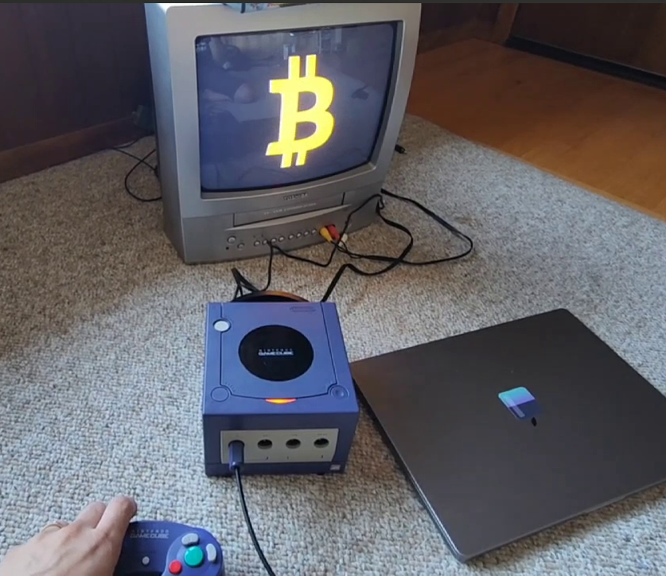

# GameCube STL Viewer

A professional, modular STL file viewer for Nintendo GameCube that renders 3D models with enhanced lighting and smooth camera controls.



## Features

### 🎮 Enhanced User Interface
- **Professional Menu System**: Clean, boxed interface with file selection
- **Live File Information**: Real-time display of selected file details including size
- **Scrollable File Lists**: Support for large numbers of STL files with scroll indicators
- **Loading Screens**: Visual feedback during file loading operations

### 🎨 Advanced 3D Rendering
- **Multi-Light System**: Four-point lighting setup (key, fill, rim, and bounce lights)
- **Material-Based Coloring**: Bitcoin orange theme with surface-normal-based color variations
- **Smooth Camera Controls**: Full 360° rotation with analog stick and D-pad fine control
- **Zoom Controls**: Multiple zoom levels with L/R triggers and Z button for fast zoom

### 📁 Robust File Management
- **Multi-Source Support**: Scans SD card, USB drive, and local directory
- **File Validation**: Checks file size and format before loading
- **Automatic Sorting**: Alphabetical file organization
- **Format Detection**: Automatic binary/ASCII STL format detection

### 🏗️ Professional Architecture
- **Modular Design**: Clean separation of concerns with dedicated classes
- **Memory Management**: Proper resource allocation and cleanup
- **Error Handling**: Comprehensive error checking and user feedback
- **Extensible Structure**: Easy to add new features and file formats

## Controls

### Menu Navigation
- **D-Pad Up/Down**: Navigate through STL files
- **A Button**: Load selected STL file
- **START Button**: Exit application

### 3D Viewer
- **Analog Stick**: Primary camera rotation (360° horizontal, constrained vertical)
- **C-Stick**: Fine camera rotation control
- **D-Pad**: Precise camera adjustment
- **L/R Triggers**: Zoom in/out
- **Z Button**: Fast zoom in
- **B Button**: Return to file menu

## File Support

### Supported Formats
- **Binary STL**: Full support with robust parsing
- **ASCII STL**: Framework in place (implementation can be extended)

### File Sources
- SD Card root directory (`sd:/`)
- USB drive root directory (`usb:/`)
- Local directory (fallback for development)

### File Validation
- Minimum file size checking (84 bytes)
- Maximum file size limit (100MB)
- Format verification
- Triangle count validation

## Technical Architecture

### Core Classes

#### `STLViewer`
Main application coordinator that manages all subsystems and handles the main game loop.

#### `Mesh`
Handles 3D geometry data with STL file loading, bounding box calculation, and memory management.

#### `Renderer`
Advanced 3D rendering system with:
- Multi-light setup
- Camera transformations
- Material-based coloring
- GameCube graphics pipeline optimization

#### `FileManager`
File system interface with:
- Multi-source file scanning
- File validation
- Metadata extraction
- Path utilities

#### `InputHandler`
Controller input processing with:
- Button state management
- Analog stick handling with deadzone
- Camera control helpers
- Menu navigation support

#### `UI`
User interface system featuring:
- Styled menu boxes
- File list display with scrolling
- Status messages
- Loading screens

### Memory Management
- Proper allocation/deallocation of all resources
- Separate frame buffers for menu and 3D rendering
- FIFO buffer management for graphics pipeline
- Automatic cleanup on shutdown

### Graphics Pipeline
- Hardware-accelerated 3D rendering
- Depth testing and culling control
- Multi-light illumination model
- Perspective projection with configurable parameters

## Building

### Prerequisites
- DevkitPPC toolchain
- libogc libraries
- GameCube development environment

### Build Commands
```bash
make clean
make
```

### Output
- `gamecube_stl_viewer.dol` - GameCube executable
- `gamecube_stl_viewer.elf` - Debug symbols

## Installation

1. Copy the `.dol` file to your GameCube homebrew loader
2. Place STL files in the root directory of your SD card or USB drive
3. Launch the application through your homebrew loader

## Development

### Project Structure
```
source/
├── main.cpp           # Application entry point
├── STLViewer.h/cpp    # Main application class
├── Mesh.h/cpp         # 3D geometry handling
├── Renderer.h/cpp     # Graphics rendering system
├── FileManager.h/cpp  # File system interface
├── InputHandler.h/cpp # Controller input processing
└── UI.h/cpp          # User interface system
```

### Adding New Features
The modular architecture makes it easy to extend functionality:

- **New File Formats**: Extend `Mesh` class with additional loaders
- **Enhanced UI**: Add new methods to `UI` class
- **Input Modes**: Extend `InputHandler` for new control schemes
- **Rendering Effects**: Enhance `Renderer` with new visual features

### Code Style
- Professional C++ with proper RAII
- Comprehensive error handling
- Clear separation of concerns
- Extensive documentation

## Performance

### Optimizations
- Hardware-accelerated rendering
- Efficient memory usage
- Optimized file I/O
- Smooth 60 FPS rendering

### Tested With
- Various STL file sizes (up to 100MB)
- Complex geometric models
- Multiple file sources simultaneously

## Troubleshooting

### Common Issues

**"No STL files found"**
- Ensure STL files are in the root directory of SD/USB
- Check file extensions (.stl)
- Verify file system is properly mounted

**"Failed to load STL file"**
- File may be corrupted or invalid format
- Check file size (must be > 84 bytes, < 100MB)
- Ensure binary STL format for best compatibility

**Graphics not displaying**
- Check video cable connections
- Ensure proper GameCube video mode
- Try different display settings

## License

This project is open source. Feel free to modify and distribute according to your needs.

## Contributing

Contributions are welcome! Areas for improvement:
- ASCII STL format support
- Additional file format support
- Enhanced lighting models
- UI improvements
- Performance optimizations

## Acknowledgments

- DevkitPro team for GameCube development tools
- libogc contributors for system libraries
- GameCube homebrew community for documentation and support
